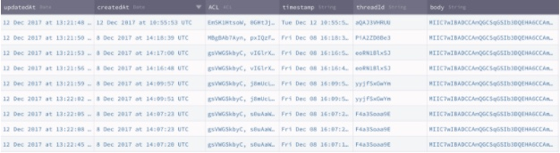

# End-to-End Encrypted Chat & the road to HIPAA & GDPR compliance!

**Ahoy Back4app community!**

This is a guest post by Virgil Security: we’re the tech behind [Twilio’s End-to-End Encrypted Messaging][_twilio]. We’ve been asked by our friends @ Back4app to show you how to build an End-to-End encrypted chat app on top of Back4app.

In this post, we’ll walk you through the steps to make [Back4app’s Android Simple Messenger app][_back4app] End-to-End Encrypted! Are you ready? Or if you don’t care about the details, you can simply skip to the end of the post and download the final product.

## What is End-to-End Encryption?

First, let’s start with a quick refresher of what E2EE is and how it works. E2EE is simple: when you type in a chat message, it gets encrypted on your mobile device (or in your browser) and gets decrypted only when your chat partner receives it and wants to display it in chat window.


So essentially, the message remains encrypted while travels over wifi, the internet, gets on the web server, goes into the database and on the way back to your chat partner. In other words, none of the networks or servers have a clue of what the two of you are chatting about.


What’s difficult in End-to-End Encryption is the task of managing the encryption keys: managing them in a way that only the users involved in the chat can access them and nobody else. And when I write “nobody else”, I really mean it: even insiders of your cloud provider or even you, the developer are out; [no accidental mistakes][_mistakes] or legally enforced peeking are possible. Writing crypto, especially for multiple platforms is hard: generating true random numbers, picking the right algorithms, choosing the right encryption modes are just a few examples that make most of us developers just end up NOT doing it.

This blog post is about how to ignore all these annoying details and just End-to-End Encrypt using Virgil’s SDK.


**For an intro, this is how we’ll upgrade Back4app’s messenger app to be End-to-End Encrypted:**
1. During sign-up: we’ll generate individual private & public key for new users (remember: public key encrypts messages, the matching private key decrypts them).
2. You’ll encrypt chat messages with the destination user’s public key before they’re sent,
3. When receiving messages, you’ll decrypt them with your user’s private key.


We’ll publish the users’ public keys to Virgil’s Cards Service for chat users to be able to look up each other and be able to encrypt messages for each other; the private keys will be kept on the user devices.

**Keep it simple**

This is the simplest possible implementation of E2EE chat and it works perfectly for simple chat apps between 2 users where conversations are short-lived and the message history is OK to be lost if a device is lost with the private key on it. For a busier, Slack-like chat app where history is important and users are joining and leaving channels all the time, we’ll build a Part II for this post: [sign up here if you’re interested][_next_post] and we’ll ping you once we have it.

**OK, enough talking! Let’s get down to coding.**

- We’ll start by guiding you through the Android app’s setup,
- Then, we’ll make you add the E2EE code and explain what each code block does.

**Prerequisites:**

- Sign up for a [Back4app account][_back4app_account] and create a new app;
- Sign up for a [Virgil Security account][_virgil] (we’ll create the app later)
- You’ll need [Android Studio][_android_studio] for the coding work, we used 3.0.1.

## Let’s set up the Back4app messenger app

### 1) Import Project in Android Studio:
  - File -> New -> Project from Version Control -> Git
  - Git Repository URL: https://github.com/VirgilSecurity/chat-back4app-android
  - Check out the “clean-chat” branch


### 2) Set up the App with the Credentials from your new Back4App App’s Dashboard:
  - Open “Dashboard” of your app -> “App Settings” -> “Security & Keys”:
  
  - Return to your  `/app/src/main/res/values/strings.xml` file in the project and paste your “App Id” into “back4app_app_id” and “Client Key” into “back4app_client_key”.
```xml
<string name="back4app_server_url">https://parseapi.back4app.com/</string>
<string name="back4app_app_id">0YP4zSHDOZy5v5123e2ttGRkG123aaBTUnr6wfH</string>
```

### 3) Enable Live Query to get live updates for messages and chat threads: 
  - Launch Data Management for your app and create two classes: `Message` and `ChatThread`:

    

  - Go back to your [Back4App account][_back4app_admin]
  - Press the “Server Settings” button on your Application
  - Find the “Web Hosting and Live Query” block
  - Open the Live Query Settings  and check the “Activate Hosting” option.
  - Choose a name for your subdomain to activate Live Query for the 2 classes you created: `Message` and `ChatThread`.
  - Copy your new subdomain name and click the SAVE button:
  

Return to `/app/src/main/res/values/strings.xml` and paste "Subdomain name" you have entered above into the `back4app_live_query_url` instead of "yourSubdomainName":
```xml
<string name="back4app_live_query_url">wss://yourSubdomainName.back4app.io/</string>
```

### Now you can build and run your app on your device or emulator:


If it all worked out, you should see the chat messenger app popping up. Register two users and send a few messages to each other: you should see new data showing up in the Message class:

**Note that you can see on the server what your users are chatting about:**


**Next**: Close your chat interface and move on to the next step – adding E2EE encryption.

## Now, let’s End-to-End Encrypt those messages!

By the end of this part, this is how your chat messages will look like on the server: can you spot the difference?



And this is how we’ll get there:
  - **Step 1:** we’ll set up a minimal Back4App server app that will approve the creation of new users at registration time: otherwise, you’ll end up with a bunch of spam cards. Later, you can introduce an email/SMS verification by customizing this app!
  - **Step 2:** we’ll modify the messenger app by adding E2EE code; I’ll do my best to explain every step along the way, hopefully simply enough that you can continue playing with it and reuse in your own project!

But before we begin, let’s clear 2 important terms for you: what’s a Virgil Key and a Virgil Card?

  - **Virgil Key** – this is how we call a user's private key. Remember, private keys can decrypt data that was encrypted using the matching public key.
  - **Virgil Card** – Virgil Сards carry the user’s public key. Virgil cards are published to Virgil’s Cards Service (imagine this service like a telephone book) for other users to retrieve them: Alice needs to retrieve Bob’s Public Key in order to encrypt a message for Bob using that key. 

### Step 1: Set up your App Server

You’ll need some minimal server code to make the sample work. This piece of server code will enable you to verify new users before they can start using Virgil’s crypto service. To keep this app server simple, we created one for you: it will automatically approve all new users. Later, you can add your own SMS/email verification code, so that you won’t end up with a ton of false users.

**Let’s get started:**
- [Download this archive][_main_js_package_json] that contains two files: `main.js` and `package.json`;
- Extract the archive and open `main.js` with your favorite editor;
- Go back to your [Virgil developer account][_virgil_account] and create a new application. Make sure that you save the Private Key that is generated for your application. Also, copy the new app’s base64-encoded AppKey string before you complete the app creation:

- Edit main.js, find the function `resolveAppKEy()` and replace: 
  - `YOUR_VIRGIL_APP_PRIVATE_KEY` with the Base64 AppKey on your clipboard
  - `YOUR_VIRGIL_APP_PRIVATE_KEY_PASSWORD` with the password you’ve set for your new Virgil app: 
    ```javascript
    function resolveAppKey() {
      try {
        return virgil.crypto.importPrivateKey('MIGhMF0GCSqGSIb3DQEFDTBQMC8GCSqGSIb3DQEFDDAiBBAmU9m+EJOvLRxRaJP6d......',
          'a0KEOifsd2Ean6fzQ'
        );
      } catch (e) {
        return null;
      }
    }
  ```
- Now, go back to your Virgil dashboard and copy your new app’s **App ID**:

- Find the function `signCardRequest` and replace `YOUR_VIRGIL_APP_ID` with the ID on your clipboard:
```javascript
function signCardRequest(cardRequest) {
  const signer = virgil.requestSigner(virgil.crypto);
  signer.authoritySign(cardRequest, 'bd7bf7e832f16e2b3f6fd343s1f90778ab0e15515aa775e7b7db3', appKey);
}
```
- Now, let’s get back to the Virgil dashboard and create a new token for your app:

- Choose any name, leave all settings as-is and generate the token:
 
- As a result, you get the Access Token:
  
- Copy the Token to the clipboard, find the function `signCardRequest(cardRequest, appKey)` and replace `YOUR_VIRGIL_APP_ACCESS_TOKEN` with the token on your clipboard:

```javascript
signCardRequest(cardRequest);
const client = virgil.client('AT.8641c450a983a3435aebe79sad32abea997d29b3e8eed7b35beab72be3');
client.publishCard(cardRequest)
...
```

**Now, back to the Back4app dashboard:**
- Go to your App Dashboard at Back4App website:
  
- Open “Server Settings” and find “Cloud Code”:

  
- Open Cloud “Settings”
- Upload the main.js and package.json files in your Cloud Code settings and press “save” button:
  


### Step 2: Update Android app with E2EE code

**Add Virgil’s Android SDK to your project:**

- In the app-level gradle at /app/[build.gradle][_build.gradle_app_level]:
```gradle
implementation "com.virgilsecurity.sdk:crypto-android:$rootProject.ext.virgilSecurity"
implementation "com.virgilsecurity.sdk:sdk-android:$rootProject.ext.virgilSecurity"
```

- Add the following to the end of your project-level /[build.gradle][_build.gradle_project_level]:
```gradle
virgilSecurity = “4.5.0@aar”
```

**Enter your access token:**

- Open /app/src/main/res/values/strings.xml and add copy & paste your Virgil token and App ID from the Virgil app dashboard:
```xml
<string name="virgil_token">AT.8641c450a983a3435aebe7994fd41235fs0babea997d29b3e8eewed7b35beab72be3</string>
<string name="virgil_app_id">bd7bf7e832f16e2b3f61fa32dw282cbfc6b3d31f90778ab0e15faa775e7b7db3</string>
```
Note: for simplicity, we re-used the access token you created for the server app. Don’t do this in production: create a separate token for your mobile app with Search-only permissions!

**Import E2EE code**

Replace the following files in your code:

- LogInFragment.java file with [LogInFragment.java][_LogInFragment.java]
- ChatThreadFragment.java file  with [ChatThreadFragment.java][_ChatThreadFragment.java]
- ChatThreadPresenter.java file with [ChatThreadPresenter.java][_chat_thread_presenter]
- ChatThreadRVAdapter.java with [ChatThreadRVAdapter.java][_ChatThreadRVAdapter.java]
- LogInPresenter.java with [LogInPresenter.java][_login_presenter]
- RxParse.java with [RxParse.java][_rxparse]


### Let’s look at what’s changed in the app

**For every chat user, the new E2EE app maintains a private & public key:**

1. We generate the private & public key pair as part of signup
2. Store the private Key in the key storage on the device
3. Publish the public key in Virgil’s Card Service as a “Virgil Card” for other users to download & encrypt messages with it.


#### 1. Generate Private Key

This is how we generate the private key (for decrypting incoming chat messages) as part of signup in ../virgilsecurity/virgilback4app/auth/LogInPresenter:
```java
private Single<Pair<VirgilCard, VirgilKey>> createCard(String identity) {
    return Single.create(e -> {
        VirgilKey privateKey = virgilApi.getKeys().generate();
...
```

#### 2. Store the Private Key in a Key storage on the mobile device

In the same class, after a successful signup, we save the private key to the Android device’s key storage system. Virgil’s SDK takes care of this step for you:
```java
private void saveLastGeneratedPrivateKey() {
    if (privateKey != null) {
        try {
            privateKey.save(myVirgilCard.getIdentity());
        } catch (VirgilKeyIsAlreadyExistsException e) {
            e.printStackTrace();
        }
    }
}
```


#### Create and Publish Virgil Card

Next, in the LogInPresenter class, we create the user’s Virgil card using the user’s private key. In the background, this operation generates a public key from the private key and this public key will be attached to the user’s Virgil card:

```java
...
    VirgilCard userCard = virgilApi.getCards().create(identity, privateKey);
    if (userCard == null)
        e.onError(new VirgilCardNotCreatedException());

    e.onSuccess(new Pair<>(userCard, privateKey));
});
}
```

Then, we pass this to the Back4App code that will intercept the create user request and publish the Virgil card on Virgil’s Card Service.

Now you need to send this Card request to the App Server where it has to be signed with your application's Private Key (AppKey).

The VirgilCard object has a convenience method called export that returns the base64-encoded string representation of the request suitable for transfer (../virgilsecurity/virgilback4app/util/RxParse.javaRxParse class):
```java
public static Observable<VirgilCard> signUp(String username, 
                                            String password, 
                                            VirgilCard card) {
    return Observable.create(e -> {
        final ParseUser user = new ParseUser();
        user.setUsername(username);
        user.setPassword(password);
        user.put(Const.Request.CRETE_CARD, card.export());
```

Now your project automatically sends the Virgil Card exported to base64 to the Back4App, after that Cloud Code intercepts and publishes it.

**We encrypt messages with the recipient user's Virgil card.**

See ../virgilsecurity/virgilback4app/chat/thread/ChatThreadPresenter:

- The Sender must search for the receiver's Virgil Cards using the Virgil Cards Service:
```java
private Single<VirgilCard> findCard(String identity) {
    return Single.create(e -> {
        VirgilCards cards = virgilApi.getCards().find(identity);
        if (cards.size() > 0) {
            e.onSuccess(cards.get(0));
        } else {
            e.onError(new VirgilCardIsNotFoundException());
        }
    });
}
```

- Encrypt message using the card::
```java
public String encrypt(String text, VirgilCards cards) {
    String encryptedText = null;

    try {
        VirgilKey key = loadKey(getMyCard().getIdentity());
        encryptedText = key.signThenEncrypt(text, cards).toString(StringEncoding.Base64);
    } catch (VirgilKeyIsNotFoundException e) {
        e.printStackTrace();
    } catch (CryptoException e) {
        e.printStackTrace();
    }

    return encryptedText;
}
```


**Decrypt the Encrypted Message in the ChatThreadRVAdapter class**

- We first load the user’s private key from Android’s secure storage
- Then use it to decrypt the message received:
```java
public String decrypt(String text, VirgilCard card) {
    String decryptedText = null;

    try {
        VirgilKey virgilKey = loadKey(getMyCard().getIdentity());
        decryptedText = virgilKey.decryptThenVerify(text, card).toString();
    } catch (VirgilKeyIsNotFoundException e) {
        e.printStackTrace();
    } catch (CryptoException e) {
        e.printStackTrace();
    }

    return decryptedText;
}
```


## Final project
If you missed pieces from the puzzle, open the E2EE project branch. You can insert your application credentials in this code (as you did during the article) and build the project.


## HIPAA compliance:

End-to-End Encryption is a way to meet the technical requirements for HIPAA. If you need more details, sign up for a free [Virgil account][_virgil], join our Slack community and ping us there: we’re happy to discuss your own privacy circumstances and help you understand what’s required to meet the technical HIPAA requirements.


## Any questions?

Shortly following your Virgil signup, we invite you to our Slack community where you can ask questions or share your learnings with others. Also, feel free to post questions to the Back4app community groups, we’re listening there too!


[_mistakes]: https://techcrunch.com/2017/11/29/meet-the-man-who-deactivated-trumps-twitter-account/
[_twilio]: https://www.twilio.com/blog/2016/05/introducing-end-to-end-encryption-for-twilio-ip-messaging-with-virgil-security.html
[_back4app]: https://docs.back4app.com/docs/new-parse-app/simple-messenger/
[_next_post]: https://virgilsecurity.us13.list-manage.com/subscribe?u=b2d755932a192a668f143411a&id=d2891963f1
[_back4app_account]: https://www.back4app.com/
[_back4app_admin]: https://dashboard.back4app.com/apps/#!/admin
[_android_studio]: https://developer.android.com/studio/index.html
[_virgil_account]: https://developer.virgilsecurity.com/account/signup
[_build.gradle_app_level]: https://github.com/VirgilSecurity/chat-back4app-android/blob/e2ee/app/build.gradle
[_build.gradle_project_level]: https://github.com/VirgilSecurity/chat-back4app-android/blob/e2ee/build.gradle
[_string.xml]: https://github.com/VirgilSecurity/chat-back4app-android/blob/e2ee/app/src/main/res/values/strings.xml
[_login_presenter]: https://github.com/VirgilSecurity/chat-back4app-android/blob/e2ee/app/src/main/java/com/android/virgilsecurity/virgilback4app/auth/LogInPresenter.java
[_chat_thread_presenter]: https://github.com/VirgilSecurity/chat-back4app-android/blob/e2ee/app/src/main/java/com/android/virgilsecurity/virgilback4app/chat/thread/ChatThreadPresenter.java
[_helper]: https://github.com/VirgilSecurity/chat-back4app-android/blob/e2ee/app/src/main/java/com/android/virgilsecurity/virgilback4app/util/VirgilHelper.java
[_rxparse]: https://github.com/VirgilSecurity/chat-back4app-android/blob/e2ee/app/src/main/java/com/android/virgilsecurity/virgilback4app/util/RxParse.java
[_virgil]: https://developer.virgilsecurity.com/
[_main_js_package_json]: https://gist.github.com/vadimavdeev/0df867740156ca787908a4f2b62997b8/archive/80a7f913fdb81fa8e05f23cec30ac992aff70ee3.zip

[_ChatThreadRVAdapter.java]: https://github.com/VirgilSecurity/chat-back4app-android/blob/e2ee/app/src/main/java/com/android/virgilsecurity/virgilback4app/chat/thread/ChatThreadRVAdapter.java
[_ChatThreadFragment.java]: https://github.com/VirgilSecurity/chat-back4app-android/blob/e2ee/app/src/main/java/com/android/virgilsecurity/virgilback4app/chat/thread/ChatThreadFragment.java
[_LogInFragment.java]: https://github.com/VirgilSecurity/chat-back4app-android/blob/e2ee/app/src/main/java/com/android/virgilsecurity/virgilback4app/auth/LogInFragment.java

