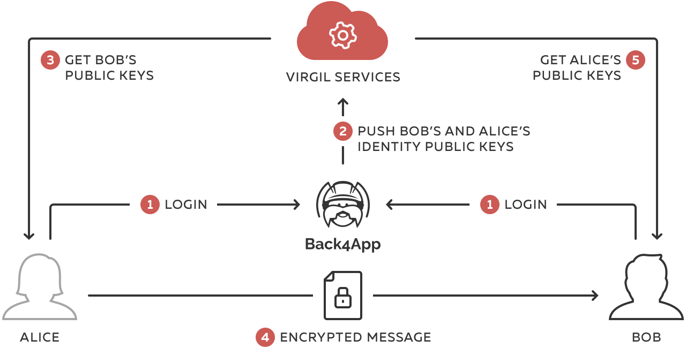
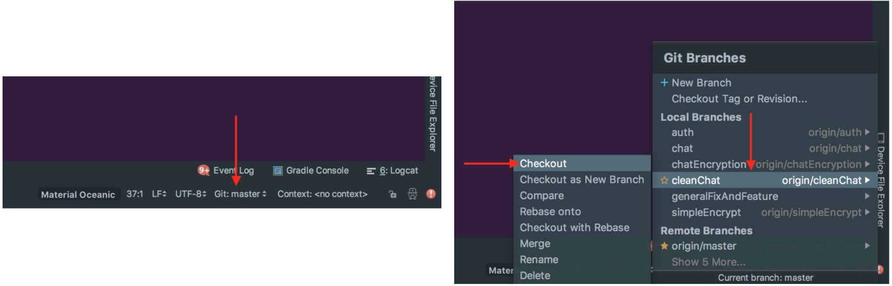
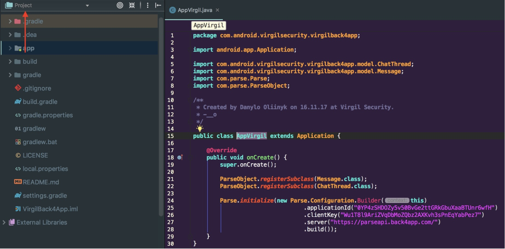
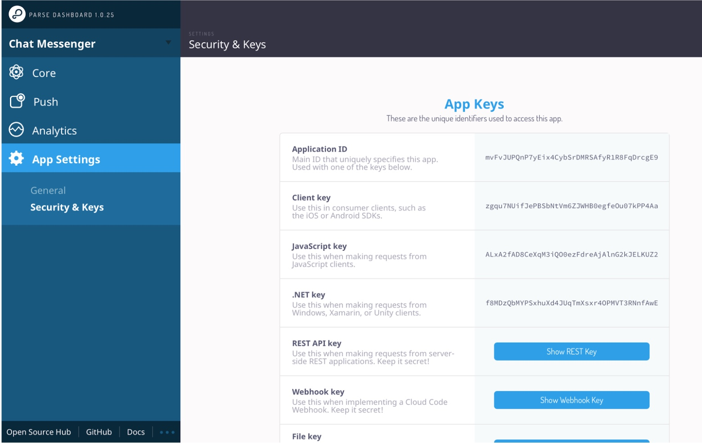
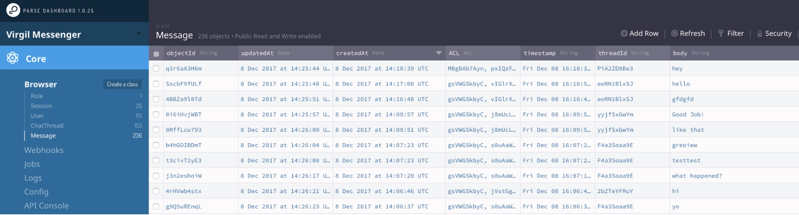
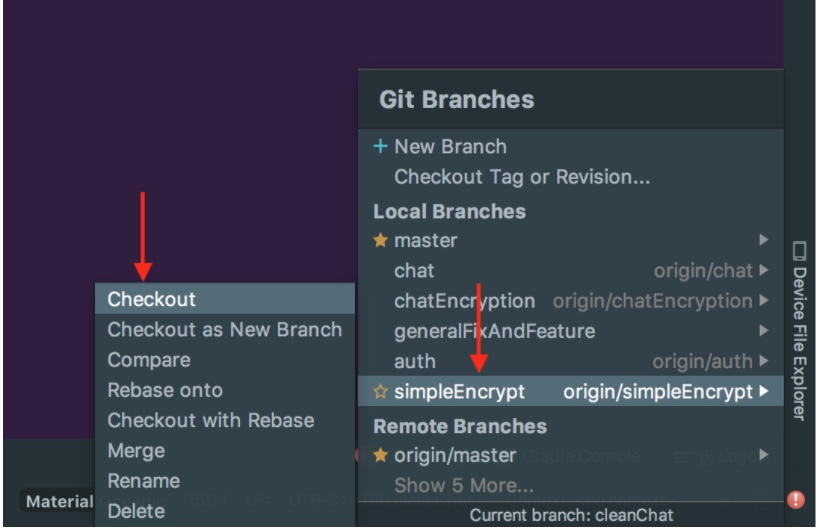

# msgr-back4app-android

**Ahoy Back4app community!**

This is a guest post by Virgil Security: we’re the tech behind [Twilio’s End-to-End Encrypted Messaging][_twilio]. We’ve been asked by our friends @ Back4app to show you how to build an End-to-End encrypted chat app on top of Back4app.

In this post, we’ll walk you through the steps to make [Back4app’s Android Simple Messenger app][_back4app] End-to-End Encrypted! Are you ready? Or if you don’t care about the details, you can simply skip to the end of the post and download the final product.

## What is End-to-End Encryption?

First, let’s start with a quick refresher of what E2EE is and how it works. E2EE is simple: when you type in a chat message, it gets encrypted on your mobile device (or in your browser) and gets decrypted only when your chat partner receives it and wants to display it in her chat window.


So essentially, the message remains encrypted while travels over wifi, the internet, gets on the web server, goes into the database and on the way back to your chat partner. In other words, none of the networks or servers have a clue of what the two of you are chatting about.


What’s difficult in End-to-End Encryption is the task of managing the encryption keys: managing them in a way that only the users involved in the chat can access them and nobody else. Also, it’s tricky to implement crypto on 3 platforms with 3 different libraries and various levels of operating system support. You’d also have to consider what type of encryption you need use for the data you want to encrypt (for example, some encryption algorithms are built for encrypting keys, while some for encrypting text, while others for encrypting images). And these are just 3 examples of why developers end up not implementing crypto.

This blog post is about how to ignore all these annoying details and just End-to-End Encrypt using Virgil’s SDK that does it all for you.

**For an intro, this is how we’ll upgrade Back4app’s messenger app to be End-to-End Encrypted:**
1. During sign-up: we’ll generate individual private & public key for new users (public keys for encryption, private keys for decryption).
2. Before sending a chat message, you’ll encrypt it with the destination user’s public key,
3. When receiving a message, you’ll decrypt it with your app user’s private key.



The user public keys, we’ll publish to Virgil’s public key directory for chat users to be able to look up; the private keys will be kept on the user devices.

This is the simplest implementation for E2EE chat and it works perfectly for simple chat use-cases where users aren’t joining and leaving existing chat channels all the time. For a busier, Slack-like chat implementation, we’ll build a Part II for this post: [sign up here if you’re interested][_next_post] and we’ll ping you once we have it.

**OK, enough talking! Let’s get down to coding.**

- We’ll start by setting up Back4app’s messenger app,
- Then, we’ll show you how to End-to-End Encrypt it!

**Prerequisites:**

- Sign up for a [Back4app account][_back4app_account] and create a new app;
- You’ need [Android Studio][_android_studio] for the coding work, we used 3.0.1.

## Let’s set up the Back4app messenger app

### 1) Import Project in Android Studio:
  - File -> New -> Project from Version Control -> Git
  - Git Repository URL: https://github.com/VirgilSecurity/chat-back4app-android
  - Check out the “cleanChat” branch

**Note!** Choose “Project” type of file tree - it will be used all-through the tutorial.

  The project will look like this:
  

### 2) Set up the App with the Credentials from your Back4App App’s Dashboard:
  - Go to your App Dashboard at Back4App website.
  - Open “Server Settings” of your app -> In “Core Settings” tile choose “Settings”:
  
  - Return to your  /app/src/main/res/values/strings.xml file in the project and paste your “App Id” into “back4app_app_id” and “Client Key” into “back4app_client_key”.
```xml
<!-- Back4App -->
<string name="back4app_server_url">https://parseapi.back4app.com/</string>
<string name="back4app_live_query_url">wss://virgilmessangerandroid.back4app.io/</string>
<string name="back4app_app_id">0YP4zSHDOZy5v5123e2ttGRkG123aaBTUnr6wfH</string>
<string name="back4app_client_key">Wu1T8l9AriZ123oZQbz2AXKvh123nEqYabPez7</string>
```

To get live updates for messages and chat threads you have to enable Live Query. Live Query can be enabled for any custom class user created, so firstly - Launch the “Data Managment” for your app and create two classes “Message” and “ChatThread”:


After you successfully created `Message` and `ChatThread` classes you should enable Live Query. Open Live Query Settings and check the “Activate Hosting” option. Also you have to enter “Subdomain name” which can be any string you want and activate Live Query for recently created classes “Message” and “ChatThread”:


### 3) Build and Run Chat without E2EE

Now you can build and run your app on a real device or on an emulator.


As a result, you see a chat messenger, where you can send and receive messages. As a server, this chat uses Back4App services.

Register two users and send few messages to each other.
If everything works properly, you should be able to see some data in `Message`, `ChatThread` and `User` classes. You able to manage data in your classes (for example you can view message text in `body` column):



**Next**: Close your chat interface and move on to the next step – adding E2EE encryption.

## Adding E2EE Encryption to Chat

Now, let’s encrypt those chat messages. By the end of this part, you’ll be able to encrypt a chat message just like this:

```java
public String encrypt(String text, VirgilCards cards) {
    String encryptedText = null;

    try {
        VirgilKey key = loadKey(getMyCard().getIdentity());
        encryptedText = key.signThenEncrypt(text, cards).toString(StringEncoding.Base64);
    } catch (VirgilKeyIsNotFoundException e) {
        e.printStackTrace();
    } catch (CryptoException e) {
        e.printStackTrace();
    }

    return encryptedText;
}
```

To get started, you need the following:

1. Virgil Security developer account: [Sign up here][_virgil_account]. Sign in to your Virgil Security developer account and create a new application. Make sure you saved the Private Key file that is generated for your application, you will need it later.

    **Note!!!** During Application Key Generation you see special window. Press “click here” link, to open AppKey in base64-       encoded string, copy and save local somewhere:
    

      You need this App Key later.

2. Checkout the simpleEncrypt branch:


**Note!** In the text below you find such terms as Virgil Key, Virgil Card, Virgil Cards Service. In Virgil Security infrastructure:
  - Virgil Key – this is how we call a User's Private Key;
  - Virgil Card – Virgil Сards carry the Users’ public information, such as their Public Key. Virgil Сards are published to Virgil’s Cards Service for other users to retrieve them (Alice retrieves Bob’s Public Key in order to encrypt a message for Bob).;

**In order to add E2EE to your chat it is necessary to perform the following steps:**
1. Setup Your Android app
2. Setup Your Server app, which approves Virgil cards creation (similar to email verification when you sign up users: otherwise, you’ll end up with a bunch of spam cards)
3. Register Users
4. Encrypt chat message before sending
5. Decrypt the encrypted message after receiving

### Step-1. Setup Your Android App
In order to generate a Private Key, Public Key for every user, and to encrypt or decrypt messages we need to install the Virgil Java SDK Package. This package contains a Vigil Crypto Library, which allows us to perform the operations we need in E2EE chat easily.

#### Add Virgil Java/Android SDK to your project
The Virgil Java/Android SDK is provided as a package named com.virgilsecurity.sdk. You can easily add the SDK package by adding the following code into your app-level [build.gradle][_build.gradle_app_level]:

```gradle
implementation "com.virgilsecurity.sdk:crypto-android:$rootProject.ext.virgilSecurity"
implementation "com.virgilsecurity.sdk:sdk-android:$rootProject.ext.virgilSecurity"
```

As well you have to add to your project-level [build.gradle][_build.gradle_project_level] (‘ext’ code block) next line:
```gradle
virgilSecurity = “4.5.0@aar”
```

#### Initialize Virgil Java/Android SDK
When users want to start sending and receiving messages in a browser or mobile device, Virgil can't trust them right away. Clients have to be provided with a unique identity, thus, you'll need to give your users the Access Token that tells Virgil who they are and what they can do. You generate Access Token in your Application Dashboard at Virgil website.

Get Access Token:
- Go to Virgil App Dashboard
- Choose your Chat Application

- Click the “Add New Token” button.
- Enter the Access Token name, choose permissions for users, and press "Generate Token":
  
- As a result, you get the Access Token:
  
- Copy this Access Token.

Initialize the Virgil SDK on a client-side:
- Open “[strings.xml][_string.xml]” file and put generated on Virgil Dashboard Access Token to the “virgil_token” string and App Id to the “virgil_app_id” string:
```xml
<string name="virgil_token">AT.8641c450a983a3435aebe7994fd41235fs0babea997d29b3e8eewed7b35beab72be3</string>
<string name="virgil_app_id">bd7bf7e832f16e2b3f61fa32dw282cbfc6b3d31f90778ab0e15faa775e7b7db3</string>
```
- Setup VirgilApiContext with virgil_token and KeyStorage with default files directory:
```java
@Provides KeyStorage provideKeyStorage(Context context) {
    return new VirgilKeyStorage(context.getFilesDir().getAbsolutePath());
}

@Provides VirgilApiContext provideVirgilApiContext(KeyStorage keyStorage, Context context) {
    VirgilApiContext virgilApiContext =
            new VirgilApiContext(context.getString(R.string.virgil_token));
    virgilApiContext.setKeyStorage(keyStorage);

    return virgilApiContext;
}
```
- Initialize VirgilApi with VirgilApiContext:
```java
@Provides VirgilApi provideVirgilApi(VirgilApiContext virgilApiContext) {
    return new VirgilApiImpl(virgilApiContext);
}
```

### Step-2. Setup your App Server

Besides the Android app, you’ll need some minimal server code to make the sample work securely and give you control over Users Cards.

To set it up, following these steps:
- [Download this archive][_main_js_package_json] that contains two files: `main.js` and `package.json`;
- Extract files from the archive and open main.js with any file editor;
- Find in main.js file:
  - Function `signCardRequest` and put your App ID from Virgil Dashboard instead of `YOUR_VIRGIL_APP_ID`;
  ```javascript
  function signCardRequest(cardRequest) {
    const signer = virgil.requestSigner(virgil.crypto);
    signer.authoritySign(cardRequest, 'bd7bf7e832f16e2b3f6fd343s1f90778ab0e15515aa775e7b7db3', appKey);
  }
  ```
  - function `resolveAppKey()` and put your Application credentials (that you got at Virgil Dashboard during App registration) instead of `YOUR_VIRGIL_APP_PRIVATE_KEY` and `YOUR_VIRGIL_APP_PRIVATE_KEY_PASSWORD`
  ```javascript
    function resolveAppKey() {
      try {
        return virgil.crypto.importPrivateKey('MIGhMF0GCSqGSIb3DQEFDTBQMC8GCSqGSIb3DQEFDDAiBBAmU9m+EJOvLRxRaJP6d......',
          'a0KEOifsd2Ean6fzQ'
        );
      } catch (e) {
        return null;
      }
    }
  ```
  **Note!** If you save previously your Virgil App's Private Key into a file (thus, you don’t have App Key in base64-encoded string), now you need to get it by performing the following command:

  in the terminal (Unix):
  `cat ~/Downloads/<your_app_name>.virgilkey | base64`

  or on Windows:
  `certutil -encode <key_name>.virgilkey tmp.b64 && findstr /v /c:- tmp.b64 > app_private_key.txt`

  - `signCardRequest(cardRequest, appKey)` and put your Access Token from Virgil dashboard instead of `YOUR_VIRGIL_APP_ACCESS_TOKEN`;
  ```javascript
  signCardRequest(cardRequest);
  const client = virgil.client('AT.8641c450a983a3435aebe79sad32abea997d29b3e8eed7b35beab72be3');
  client.publishCard(cardRequest)
  ...
  ```
  Save all your changes.

- Go to your App Dashboard at Back4App website:
  
- Open “Server Settings” and find “Cloud Code”:

  
- Open Cloud “Settings”
- Upload the main.js and package.json files in your Cloud Code settings and press “save” button:
  


We are now ready to register Users Cards =)

### Step-3. Register Users Cards

First of all, for every chat user you need to perform the following steps:
1. Generate a Public/Private Key Pair as a part of each users’ signup
2. Store the Private Key in a key storage, on the mobile device
3. Prepare Virgil Card request to publish User’s Virgil Card
4. Publish User’s Virgil Card

#### Generate Private Key

This is how we generate the Private (for decrypting incoming chat messages) Key for new users in [RxVirgil][_rxvirgil] class:
```java
private Single<Pair<VirgilCard, VirgilKey>> createCard(String identity) {
    return Single.create(e -> {
        VirgilKey privateKey = virgilApi.getKeys().generate();
...
```

#### Store the Private Key in a Key storage on the mobile device

After the Private Key is generated, we should save it locally, on user’s device, with a specific name and password. Virgil’s SDK takes care of saving the key to the Android device’s Key storage system.
```java
private void saveLastGeneratedPrivateKey() {
    if (privateKey != null) {
        try {
            privateKey.save(myVirgilCard.getIdentity());
        } catch (VirgilKeyIsAlreadyExistsException e) {
            e.printStackTrace();
        }
    }
}
```
In class named [VirgilHelper][_helper] we’re saving private key only after successful sign up.

#### Create and Publish Virgil Card

Next, we have to publish Virgil Card to Virgil Cards Services. This will be done via Back4App Cloud Code that will intercept create user request, get base64-encoded string representation of Virgil Card and publish it.

First of all we need to create Virgil Card in [RxVirgil][_rxvirgil] class:
```java
...
    VirgilCard userCard = virgilApi.getCards().create(identity, privateKey);
    if (userCard == null)
        e.onError(new VirgilCardNotCreatedException());

    e.onSuccess(new Pair<>(userCard, privateKey));
});
}
```

Now you need to send this Card request to the App Server where it has to be signed with your application's Private Key (AppKey).
The VirgilCard object has a convenience method called export that returns the base64-encoded string representation of the request suitable for transfer ([RxParse][_rxparse] class):
```java
public static Observable<VirgilCard> signUp(String username, 
                                            String password, 
                                            VirgilCard card) {
    return Observable.create(e -> {
        final ParseUser user = new ParseUser();
        user.setUsername(username);
        user.setPassword(password);
        user.put(Const.Request.CRETE_CARD, card.export());
```
Now your project automatically sends the exported to base64 Virgil Card to the Back4App after that Cloud Code intercepts and publishes it.

### Step-4. Encrypt Message

With the User's Cards in place, we are now ready to encrypt a message for encrypted communication. In this case, we will encrypt the message using the Recipient's Virgil Card.

In order to encrypt messages, the Sender must search for the receiver's Virgil Cards at the Virgil Services, where all Virgil Cards are saved.

- Looking for the receiver’s Virgil Card in [RxParse][_rxparse] class:
```java
private Single<VirgilCard> findCard(String identity) {
    return Single.create(e -> {
        VirgilCards cards = virgilApi.getCards().find(identity);
        if (cards.size() > 0) {
            e.onSuccess(cards.get(0));
        } else {
            e.onError(new VirgilCardIsNotFoundException());
        }
    });
}
```

- Then encrypting message with sender’s and receiver’s public keys in [VirgilHelper][_helper] class:
```java
public String encrypt(String text, VirgilCards cards) {
    String encryptedText = null;

    try {
        VirgilKey key = loadKey(getMyCard().getIdentity());
        encryptedText = key.signThenEncrypt(text, cards).toString(StringEncoding.Base64);
    } catch (VirgilKeyIsNotFoundException e) {
        e.printStackTrace();
    } catch (CryptoException e) {
        e.printStackTrace();
    }

    return encryptedText;
}
```

### Step-5. Decrypt the Encrypted Message

In order to decrypt the encrypted message we need to:
- Load the Private Key from the secure storage provided by default
```java
private VirgilKey loadKey(String identity) throws VirgilKeyIsNotFoundException, CryptoException {
    return virgilApi.getKeys().load(identity);
}
```

- Decrypt the message using receiver’s Private Key:
```java
public String decrypt(String text, VirgilCard card) {
    String decryptedText = null;

    try {
        VirgilKey virgilKey = loadKey(getMyCard().getIdentity());
        decryptedText = virgilKey.decryptThenVerify(text, card).toString();
    } catch (VirgilKeyIsNotFoundException e) {
        e.printStackTrace();
    } catch (CryptoException e) {
        e.printStackTrace();
    }

    return decryptedText;
}
```

## HIPAA compliance:

End-to-End Encryption is a way to meet the technical requirements for HIPAA. If you need more details, sign up for a free [Virgil account][_virgil], join our Slack community and ping us there: we’re happy to discuss your own privacy circumstances and help you understand what’s required to meet the technical HIPAA requirements.


## Any questions?

Shortly following your Virgil signup, we invite you to our Slack community where you can ask questions or share your learnings with others. Also, feel free to post questions to the Back4app community groups, we’re listening there too!


[_twilio]: https://www.twilio.com/blog/2016/05/introducing-end-to-end-encryption-for-twilio-ip-messaging-with-virgil-security.html
[_back4app]: https://docs.back4app.com/docs/new-parse-app/simple-messenger/
[_next_post]: https://virgilsecurity.us13.list-manage.com/subscribe?u=b2d755932a192a668f143411a&id=d2891963f1
[_back4app_account]: https://www.back4app.com/
[_android_studio]: https://developer.android.com/studio/index.html
[_virgil_account]: https://developer.virgilsecurity.com/account/signup
[_build.gradle_app_level]: https://github.com/VirgilSecurity/chat-back4app-android/blob/e2ee/app/build.gradle
[_build.gradle_project_level]: https://github.com/VirgilSecurity/chat-back4app-android/blob/e2ee/build.gradle
[_string.xml]: https://github.com/VirgilSecurity/chat-back4app-android/blob/e2ee/app/src/main/res/values/strings.xml
[_rxvirgil]: https://github.com/VirgilSecurity/chat-back4app-android/blob/e2ee/app/src/main/java/com/android/virgilsecurity/virgilback4app/util/RxVirgil.java
[_helper]: https://github.com/VirgilSecurity/chat-back4app-android/blob/e2ee/app/src/main/java/com/android/virgilsecurity/virgilback4app/util/VirgilHelper.java
[_rxparse]: https://github.com/VirgilSecurity/chat-back4app-android/blob/e2ee/app/src/main/java/com/android/virgilsecurity/virgilback4app/util/RxParse.java
[_virgil]: https://developer.virgilsecurity.com/
[_main_js_package_json]: https://gist.github.com/vadimavdeev/0df867740156ca787908a4f2b62997b8/archive/80a7f913fdb81fa8e05f23cec30ac992aff70ee3.zip
