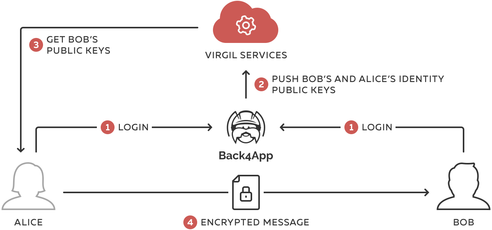
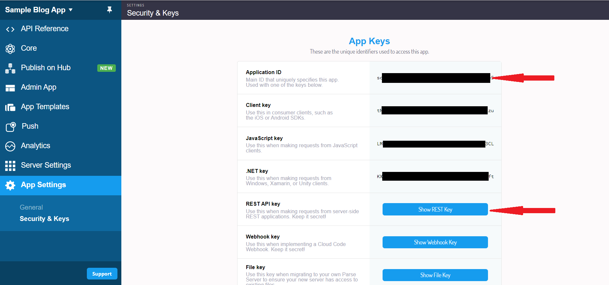
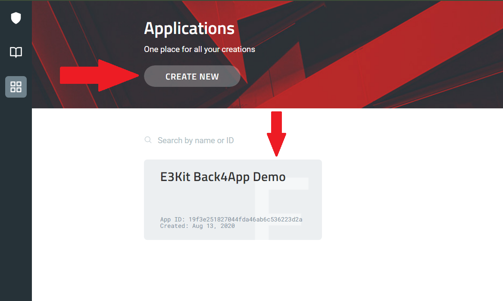
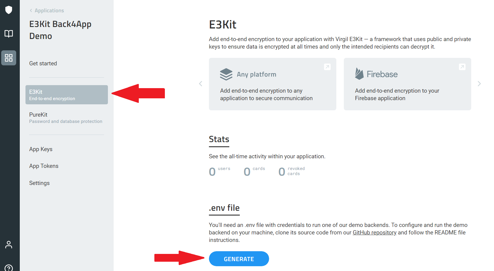
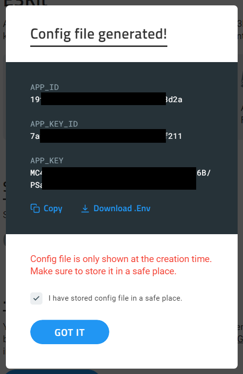
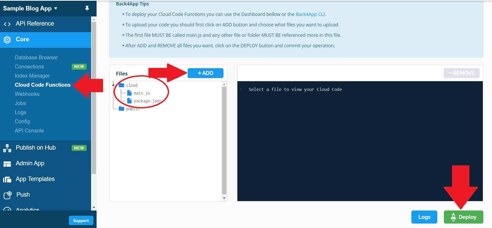
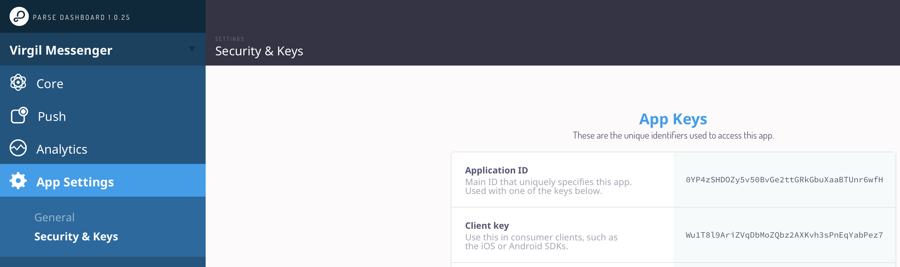
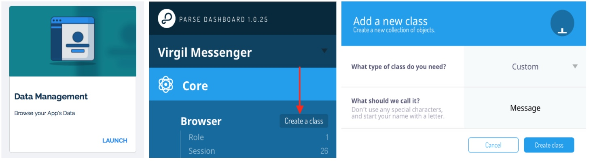
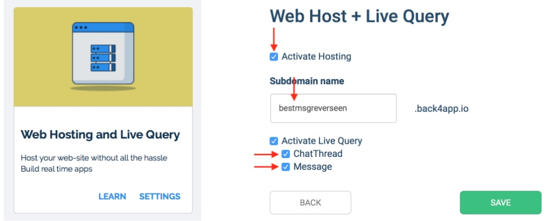
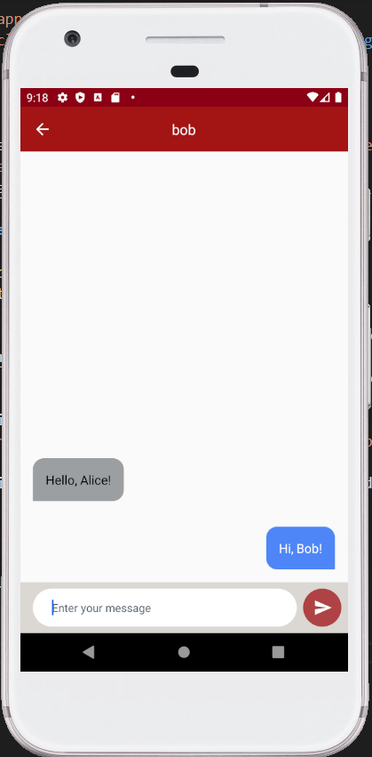

# End-to-End Encrypted Chat & the road to HIPAA & GDPR compliance!

**Ahoy Back4app community!**

We’re the crypto tech behind [Twilio’s End-to-End Encrypted Messaging][_twilio]. Our friends @ Back4app asked us to show you how to build an End-to-End Encrypted chat app on top of Back4app.

In this post, we’ll walk you through the steps to make [Back4app Android Simple Messenger app][_back4app] End-to-End Encrypted! Are you ready?

PS: If you don’t care about the details, simply skip to the practice part.

## What is End-to-End Encryption?

First, let’s start with a quick refresher of what E2EE (End-to-End Encryption) is and how it works. E2EE is simple: when you type in a chat message, it gets encrypted on your mobile device (or in your browser) and gets decrypted only when your chat partner receives it and wants to display it in chat window.


The message remains encrypted while it travels over Wi-Fi and the Internet, through the cloud / web server, into a database, and on the way back to your chat partner. In other words, none of the networks or servers have a clue of what the two of you are chatting about.


What’s difficult in End-to-End Encryption is the task of managing the encryption keys in a way that only the users involved in the chat can access them and nobody else. And when I write “nobody else”, I really mean it: even insiders of your cloud provider or even you, the developer, are out; [no accidental mistakes][_mistakes] or legally enforced peeking are possible. Writing crypto, especially for multiple platforms is hard: generating true random numbers, picking the right algorithms, and choosing the right encryption modes are just a few examples that make most developers wave their hands in the air and end up just NOT doing it.

This blog post will show you how to ignore all these annoying details and quickly and simply add End-to-End Encryption using Virgil E3Kit.


**For an intro, this is how we’ll upgrade Back4app’s messenger app to be End-to-End Encrypted:**
1. During sign-up: we’ll generate the individual private & public keys for new users (remember: the recipient's public key encrypts messages and the matching recipient's private key decrypts them).
2. Before sending messages, you’ll encrypt and sign chat messages with the recipient's public key.
3. After receiving messages, you’ll verify anf decrypt chat messages with the recipient's private key.




We’ll publish the users’ public keys to Virgil Cards Service so that chat users are able to look up each other and able to encrypt messages for each other. The private keys will stay on the user devices.

**Keep it simple**

This is the simplest possible implementation of E2EE chat and it works perfectly for simple chat apps between 2 users where conversations are short-lived and it's okay to lose the message history if a device is lost with the private key on it.

## Prerequisites

- Sign up for a [Back4app account][_back4app_account] and create a new app (Note: this demo is for Parse 3 server version);
- Sign up for a [Virgil Security account][_virgil_account] (we’ll create the app later)
- You’ll need [Android Studio][_android_studio] for the coding work, we used 3.0.1.

## Let’s set up E3Kit Back4App Kotlin Demo

### 1) Set up Back4App cloud code functions

- Find `main.js` and `package.json` in `scripts` directory;
- Open `main.js` with your favorite editor.

#### 1.1) Get Back4App credentials

If you don't have an account yet, [sign up for one](https://back4app.com).

- Open Back4App “Dashboard” of your app -> “App Settings” -> “Security & Keys”;

- Replace `PARSE_APP_ID` with your `Application ID` and `PARSE_REST_API_KEY` with your `REST API key`;

```java
const PARSE_APP_ID = "YOUR_PARSE_APP_ID";
const PARSE_REST_API_KEY = "YOUR_PARSE_REST_API_KEY";
```

#### 1.2) Get Virgil credentials

If you don't have an account yet, [sign up for one](https://dashboard.virgilsecurity.com/signup).

- Create an application on Virgil dashboard:

- Open the created application, navigate to E3Kit section and and generate a `.env` file under the E3Kit section in the left side bar:

- Copy the values of `APP_ID`, `APP_KEY`, and `APP_KEY_ID` from the `.env` file

- Replace the copied values in your `main.js` file in the appropriate places (`main.js` of `scripts` directory).

```java
const APP_ID = "YOUR_VIRGIL_APP_ID";
const APP_KEY = "YOUR_VIRGIL_APP_KEY";
const APP_KEY_ID = "YOUR_VIRGIL_APP_ID";
```

#### 1.3) Deploy cloud code function

- Open Back4App “Dashboard” of your app -> “Core” -> Cloud code functions;

- Click `+ADD` and select your `main.js` and `package.json` (from `scripts` directory), after that move both of them to the `cloud` folder;
- Click `DEPLOY`;

### 2) Start Back4app Kotlin Demo app

Don't forget to setup [Back4App cloud code function](#1-set-up-back4app-cloud-code-functions) first. It is a mandatory part of this demo. After this, go through the following steps:

#### 2.1) Import Project in Android Studio

- Open Android Studio -> File -> New -> Project from Version Control -> Git
- Git Repository URL: https://github.com/VirgilSecurity/chat-back4app-android

#### 2.2) Setup Back4App credentials

- Open Back4App “Dashboard” of your app -> “App Settings” -> “Security & Keys”;

- Go to `/app/src/main/res/values/strings.xml` file in your android project and replace `your_back4app_app_id` with your “Application ID” and `your_back4app_client_key` with your `Client Key`.

```xml
<string name="back4app_app_id">your_back4app_app_id</string>
<string name="back4app_client_key">your_back4app_client_key</string>
```

#### 2.3) Setup DB

- Open Back4App “Dashboard” -> “Core” -> “Database Browser” -> `Create a class` and create classes of `Custom` type named `Message` and `ChatThread`;


#### 2.4) Setup live query

- Go to Back4App your apps list;
- Press the “Server Settings” button on your Application;
- Find the “Web Hosting and Live Query” block;
- Open the `Live Query` Settings and check the “Activate Hosting” option as well as “Activate Live Query”;

- Choose *any* name for your `Subdomain` and activate Live Query for the 2 classes you've created: `Message` and `ChatThread`;
- Copy your new subdomain name and click the SAVE button;
- Go to `/app/src/main/res/values/strings.xml` and replace `yourSubdomainName` with the one you've created in the step above.

```xml
<string name="back4app_live_query_url">wss://yourSubdomainName.back4app.io/</string>
```

After these steps you will be able to hit the Run button in Android Studio and get the sample to work. Use emulator or real device to test it out.

### Running the demo

To see the result of running the demo, you'll need to:
1. Sign up 2 users;
2. Start a conversation between them and send a couple of messages;


3. Open Back4App “Dashboard” -> “Core” -> “Database Browser” -> "Message".


You can see the messages that users have sent to each other, but you won't be able to read their contents because they are end-to-end encrypted.


## HIPAA & GDPR compliance:

End-to-End Encryption is a way to meet the technical requirements for HIPAA (the United States' Health Insurance Portability and Accountability Act of 1996) & GDPR (the European Union's General Data Protection Regulation). If you need more details, sign up for a free [Virgil account][_virgil_account], join our Slack community and ping us there: we’re happy to discuss your own privacy circumstances and help you understand what’s required to meet the technical HIPAA & GDPR requirements.


## Where to go from here?

Virgil is a stack of security libraries and all the necessary infrastructure to enable seamless, end-to-end encryption for any application, platform or device, find more information about what you can build with Virgil Security [here][_virgil_www].

If you missed pieces from the puzzle, you can get additional information about end-to-end encryption with our [developer documentation][_virgil_docs].

Also, our developer support team is here to help you, you can find us on [Twitter](https://twitter.com/VirgilSecurity), send us email support@VirgilSecurity.com or get extra help on [Slack](https://virgilsecurity.com/join-community).

Don’t forget to subscribe to our [Youtube channel][_youtube].  There you will find a video series on how to do End-to-End Encryption.


[_mistakes]: https://techcrunch.com/2017/11/29/meet-the-man-who-deactivated-trumps-twitter-account/
[_twilio]: https://www.twilio.com/blog/2016/05/introducing-end-to-end-encryption-for-twilio-ip-messaging-with-virgil-security.html
[_back4app]: https://docs.back4app.com/docs/new-parse-app/simple-messenger/
[_next_post]: https://virgilsecurity.us13.list-manage.com/subscribe?u=b2d755932a192a668f143411a&id=d2891963f1
[_back4app_account]: https://www.back4app.com/
[_back4app_admin]: https://dashboard.back4app.com/apps/#!/admin
[_android_studio]: https://developer.android.com/studio/index.html
[_virgil_account]: https://developer.virgilsecurity.com/account/signup?utm_source=back4app&utm_medium=blog&utm_campaign=e2eechat
[_build.gradle_app_level]: https://github.com/VirgilSecurity/chat-back4app-android/blob/e2ee/app/build.gradle
[_build.gradle_project_level]: https://github.com/VirgilSecurity/chat-back4app-android/blob/e2ee/build.gradle
[_string.xml]: https://github.com/VirgilSecurity/chat-back4app-android/blob/e2ee/app/src/main/res/values/strings.xml
[_virgil_dashboard]: https://developer.virgilsecurity.com/account/dashboard?utm_source=back4app&utm_medium=blog&utm_campaign=e2eechat
[_main_js_package_json]: https://gist.github.com/vadimavdeev/0df867740156ca787908a4f2b62997b8/archive/80a7f913fdb81fa8e05f23cec30ac992aff70ee3.zip
[_youtube]: https://www.youtube.com/channel/UCU8BhA1nVzKKRiU5P4N3D6A/featured
[_final_project]: https://github.com/VirgilSecurity/chat-back4app-android/tree/e2ee
[_data_integrity]: https://developer.virgilsecurity.com/docs/java/get-started/data-integrity?utm_source=back4app&utm_medium=blog&utm_campaign=e2eechat
[_virgil_www]: https://virgilsecurity.com?utm_source=back4app&utm_medium=blog&utm_campaign=e2eechat
[_virgil_docs]: https://developer.virgilsecurity.com/docs/e3kit
[_pfs]: https://developer.virgilsecurity.com/docs/java/get-started/perfect-forward-secrecy?utm_source=back4app&utm_medium=blog&utm_campaign=e2eechat
