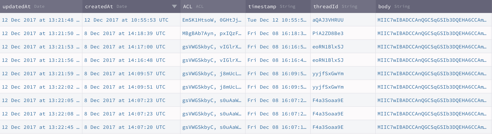

# End-to-End Encrypted Chat & the road to HIPAA & GDPR compliance!

**Ahoy Back4app community!**

We’re the crypto tech behind [Twilio’s End-to-End Encrypted Messaging][_twilio]. Our friends @ Back4app asked us to show you how to build an End-to-End Encrypted chat app on top of Back4app.

In this post, we’ll walk you through the steps to make [Back4app Android Simple Messenger app][_back4app] End-to-End Encrypted! Are you ready?

PS: If you don’t care about the details, simply skip to the practice part.

## What is End-to-End Encryption?

First, let’s start with a quick refresher of what E2EE (End-to-End Encryption) is and how it works. E2EE is simple: when you type in a chat message, it gets encrypted on your mobile device (or in your browser) and gets decrypted only when your chat partner receives it and wants to display it in chat window.


The message remains encrypted while it travels over Wi-Fi and the Internet, through the cloud / web server, into a database, and on the way back to your chat partner. In other words, none of the networks or servers have a clue of what the two of you are chatting about.


What’s difficult in End-to-End Encryption is the task of managing the encryption keys in a way that only the users involved in the chat can access them and nobody else. And when I write “nobody else”, I really mean it: even insiders of your cloud provider or even you, the developer, are out; [no accidental mistakes][_mistakes] or legally enforced peeking are possible. Writing crypto, especially for multiple platforms is hard: generating true random numbers, picking the right algorithms, and choosing the right encryption modes are just a few examples that make most developers wave their hands in the air and end up just NOT doing it.

This blog post will show you how to ignore all these annoying details and quickly and simply add End-to-End Encryption using Virgil E3Kit.


**For an intro, this is how we’ll upgrade Back4app’s messenger app to be End-to-End Encrypted:**
1. During sign-up: we’ll generate the individual private & public keys for new users (remember: the recipient's public key encrypts messages and the matching recipient's private key decrypts them).
2. Before sending messages, you’ll encrypt and sign chat messages with the recipient's public key.
3. After receiving messages, you’ll verify anf decrypt chat messages with the recipient's private key.


We’ll publish the users’ public keys to Virgil Cards Service so that chat users are able to look up each other and able to encrypt messages for each other. The private keys will stay on the user devices.

**Keep it simple**

This is the simplest possible implementation of E2EE chat and it works perfectly for simple chat apps between 2 users where conversations are short-lived and it's okay to lose the message history if a device is lost with the private key on it.

## Prerequisites

- Sign up for a [Back4app account][_back4app_account] and create a new app (Note: this demo is for Parse 3 server version);
- Sign up for a [Virgil Security account][_virgil_account] (we’ll create the app later)
- You’ll need [Android Studio][_android_studio] for the coding work, we used 4.0.

## Set up clean Virgil Back4App Kotlin Demo

### Step 1: Set up your App Server

#### 1) Set up Back4App cloud code functions

- Find `main.js` and `package.json` in `scripts` directory;
- Open `main.js` with your favorite editor.

##### 1.1) Get Back4App credentials

If you don't have an account yet, [sign up for one](https://back4app.com).

- Open Back4App “Dashboard” of your app -> “App Settings” -> “Security & Keys”;

- Replace `PARSE_APP_ID` with your `Application ID` and `PARSE_REST_API_KEY` with your `REST API key`;

```java
const PARSE_APP_ID = "YOUR_PARSE_APP_ID";
const PARSE_REST_API_KEY = "YOUR_PARSE_REST_API_KEY";
```

##### 1.2) Get Virgil credentials

If you don't have an account yet, [sign up for one](https://dashboard.virgilsecurity.com/signup).

- Create an application on Virgil dashboard:

- Open the created application, navigate to E3Kit section and and generate a `.env` file under the E3Kit section in the left side bar:

- Copy the values of `APP_ID`, `APP_KEY`, and `APP_KEY_ID` from the `.env` file

- Replace the copied values in your `main.js` file in the appropriate places (`main.js` of `scripts` directory).

```java
const APP_ID = "YOUR_VIRGIL_APP_ID";
const APP_KEY = "YOUR_VIRGIL_APP_KEY";
const APP_KEY_ID = "YOUR_VIRGIL_APP_ID";
```

##### 1.3) Deploy cloud code function

- Open Back4App “Dashboard” of your app -> “Core” -> Cloud code functions;

- Click `+ADD` and select your `main.js` and `package.json` (from `scripts` directory), after that move both of them to the `cloud` folder;
- Click `DEPLOY`;

### 2) Start clean Back4app Kotlin Demo app

Don't forget to setup [Back4App cloud code function](#1-set-up-back4app-cloud-code-functions) first. It is a mandatory part of this demo. After this, go through the following steps:

#### 2.1) Import Project in Android Studio

- Open Android Studio -> File -> New -> Project from Version Control -> Git
- Git Repository URL: https://github.com/VirgilSecurity/chat-back4app-android
- Checkout the `clean-chat` branch

#### 2.2) Setup Back4App credentials

- Open Back4App “Dashboard” of your app -> “App Settings” -> “Security & Keys”;

- Go to `/app/src/main/res/values/strings.xml` file in your android project and replace `your_back4app_app_id` with your “Application ID” and `your_back4app_client_key` with your `Client Key`.

```xml
<string name="back4app_app_id">your_back4app_app_id</string>
<string name="back4app_client_key">your_back4app_client_key</string>
```

#### 2.3) Setup DB

- Open Back4App “Dashboard” -> “Core” -> “Database Browser” -> `Create a class` and create classes of `Custom` type named `Message` and `ChatThread`;


#### 2.4) Setup live query

- Go to Back4App your apps list;
- Press the “Server Settings” button on your Application;
- Find the “Server URL and Live Query” block;
- Open the `Live Query` Settings and check the “Activate Hosting” option as well as “Activate Live Query”;

- Choose *any* name for your `Subdomain` and activate Live Query for the 2 classes you've created: `Message` and `ChatThread`;
- Copy your new subdomain name and click the SAVE button;
- Go to `/app/src/main/res/values/strings.xml` and replace `yourSubdomainName` with the one you've created in the step above.

```xml
<string name="back4app_live_query_url">wss://yourSubdomainName.back4app.io/</string>
```

After these steps you will be able to hit the Run button in Android Studio and get the sample to work. Use emulator or real device to test it out.

### Step 3: Run the clean demo

To see the result of running the clean version of the demo, you'll need to:
1. Sign up 2 users;
2. Start a conversation between them and send a couple of messages;

3. Open Back4App “Dashboard” -> “Core” -> “Database Browser” -> "Message".

If it all worked out, you should see the chat messenger app popping up. Register two users and send a few messages to each other: you should see new data showing up in the Message class. Note that you can see on the server what your users are chatting about:


Next: Close your chat interface and move on to the next step – adding E2EE encryption.


## Add end-to-end encryption to E3Kit Back4App Kotlin Demo

By the end of this part, this is how your chat messages will look like on the server: can you spot the difference?



How do we get there? Obviously, we need to implement end-to-end encryption, which means that our app needs to:

* Generate the private & public key pair as part of signup
* Store the private key in the key storage on user's device
* Publish the public key in Virgil’s Card Service as a “Virgil Card” for other users to download & encrypt messages with it
* Encrypt messages with public key and sign with private key; decrypt messages with private key and verify with public key

For this, we will need to add E3Kit to our clean demo application and some more code to implement all that was described above.


### Step 1: Add E3Kit to the clean E3Kit Back4App Kotlin Demo

- In the app-level (`Module: app`) gradle at `/app/build.gradle` add (but don't sync gradle scripts just yet):

```
implementation "com.virgilsecurity:ethree:$rootProject.ext.ethree"
```

- Add the following to the end of your project-level `/build.gradle` (`Project: chat-back4app-android`):
```
ext {
  ethree = "2.0.5"
}
```

- Now you can synchronize gradle scripts;
- Update your `AppVirgil` class by adding new fields:

```kotlin
companion object {
  lateinit var eThree: EThree
  fun isEthreeInitialized() = ::eThree.isInitialized
}
```

- Press `Alt + Enter` to import the necessary libraries into the class.

### Step 2: Authenticate users with Back4App Cloud Code

- In `../virgilsecurity/virgilback4app/model/` directory, create data classes `AuthenticateResponse` and `VirgilJwtResponse` that represent ressponses from Cloud Code functions:

```kotlin
data class AuthenticateResponse(val authToken: String)

data class VirgilJwtResponse(val virgilToken: String)
```

- In `../virgilsecurity/virgilback4app/util/` create `AuthRx` object that implements calls to Cloud Code functions (don't forget to import all the necessary libraries afterwards):

```kotlin
object AuthRx {

    /**
     * You can call it only after successful [authenticate]
     */
    fun virgilJwt(sessionToken: String) = Single.create<String> { emitter ->
        val requestParams = mutableMapOf<String, String>().apply {
            put("sessionToken", sessionToken)
        }

        ParseCloud.callFunctionInBackground<Map<String, Any>>(
            KEY_VIRGIL_JWT,
            requestParams
        ) { virgilJwt, exception ->
            if (exception == null)
                emitter.onSuccess(virgilJwt[KEY_TOKEN].toString())
            else
                emitter.onError(exception)

        }
    }

    private const val KEY_VIRGIL_JWT = "virgil-jwt"
    private const val KEY_TOKEN = "token"
}
```


### Step 3: Store Virgil JWT locally

Virgil token received from Cloud Code functions needs to be stored locally. Let's update `Preferences` class in `../virgilsecurity/virgilback4app/util/`:

- Define a constant:

```kotlin
private const val KEY_VIRGIL_TOKEN = "KEY_VIRGIL_TOKEN"
```

- Add functions `setVirgilToken`, `virgilToken` and `clearVirgilToken`:
```kotlin
fun setVirgilToken(virgilToken: String) {
    with(sharedPreferences.edit()) {
        putString(KEY_VIRGIL_TOKEN, virgilToken)
        apply()
    }
}

fun virgilToken(): String? {
    with(sharedPreferences) {
        return getString(KEY_VIRGIL_TOKEN, null)
    }
}

fun clearVirgilToken() {
    with(sharedPreferences.edit()) {
        remove(KEY_VIRGIL_TOKEN)
        apply()
    }
}
```

Virgil token should be reset on logout. Let's add `Preferences.instance(this).clearVirgilToken()` line into `initDrawer` function of `ThreadsListActivity` class  (in `../virgilsecurity/virgilback4app/chat/contactsList/`):
```kotlin
private fun initDrawer() {
    ...
    nvNavigation.setNavigationItemSelectedListener { item ->
        R.id.itemLogOut -> {
            dlDrawer.closeDrawer(GravityCompat.START)
            presenter.disposeAll()
            showBaseLoading(true)
            // New code >>
            Preferences.instance(this).clearVirgilToken()
            // >> New code
            ...
        }
    }
}
```

### Step 4: Modify user registering

E3Kit takes care about your private and public keys. To generate them during the registering process, we'll need to do the following:

- In `../virgilsecurity/virgilback4app/util/` create `RxEthree` class:

```kotlin
class RxEthree(val context: Context) {

    private val preferences = Preferences.instance(context)
}
```

- Now, add `initEthree` function that initializes E3Kit instance in `RxEthree` class:

```kotlin
import com.virgilsecurity.android.common.model.EThreeParams
import com.virgilsecurity.android.ethree.interaction.EThree


fun initEthree(identity: String, verifyPrivateKey: Boolean = false): Single<EThree> = Single.create { e ->
    val params = EThreeParams(identity, {preferences.virgilToken()!!}, context)
    val ethree = EThree(params)
    if (verifyPrivateKey) {
        if (ethree.hasLocalPrivateKey()) {
            e.onSuccess(ethree)
        } else {
            e.onError(KeyEntryNotFoundException())
        }
    } else {
        e.onSuccess(ethree)
    }
}
```

- Add `registerEthree` function that registers a new user to `RxEthree` class. 
E3Kit generates a key pair during a sign up. The generated private key then is stored in local storage, and public key is published to Virgil Services as a Virgil Card.

```kotlin
import com.android.virgilsecurity.virgilback4app.AppVirgil
import com.virgilsecurity.common.callback.OnCompleteListener
import io.reactivex.Completable


fun registerEthree(): Completable = Completable.create { e ->
    AppVirgil.eThree.register().addCallback(object : OnCompleteListener {
        override fun onError(throwable: Throwable) {
            e.onError(throwable)
        }

        override fun onSuccess() {
            e.onComplete()
        }

    })
}
```

Let’s make some updates to `LogInPresenter` class (in `../virgilsecurity/virgilback4app/auth/`).

- Add `rxEthree` field:
```kotlin
private val rxEthree = RxEthree(context)
```

- Update the `requestSignUp` function to run registration with E3Kit:
```kotlin
fun requestSignUp(identity: String, onSuccess: () -> Unit, onError: (Throwable) -> Unit) {
    val password = generatePassword(identity.toByteArray())

    val disposable = RxParse.signUp(identity, password)
            .subscribeOn(Schedulers.io())
            .observeOn(Schedulers.io())
            // New code >>
            .toSingle { ParseUser.getCurrentUser() }
            .flatMap { AuthRx.virgilJwt(it.sessionToken) }
            .map { preferences.setVirgilToken(it) }
            .flatMap { rxEthree.initEthree(identity) }
            .map { AppVirgil.eThree = it }
            .flatMap { rxEthree.registerEthree().toSingle { Unit } }
            // << New code
            .observeOn(AndroidSchedulers.mainThread())
            // Updated code >>
            .subscribeBy(
                onSuccess = {
                    onSuccess()
                },
                onError = {
                    onError(it)
                }
            )
            // << Updated code

    compositeDisposable += disposable
}
```

### Step 3: Modify sign in functions

Now, let’s make changes to `requestSignIn` method of `LogInPresenter` class (in `../virgilsecurity/virgilback4app/auth/`):
```kotlin
fun requestSignIn(identity: String,
                  onSuccess: () -> Unit,
                  onError: (Throwable) -> Unit) {

    val password = generatePassword(identity.toByteArray())

    val disposable = RxParse.logIn(identity, password)
            .subscribeOn(Schedulers.io())
            .observeOn(Schedulers.io())
            // New code >>
            .flatMap { AuthRx.virgilJwt(it.sessionToken) }
            .map { preferences.setVirgilToken(it) }
            .flatMap { rxEthree.initEthree(identity, true) }
            .map { AppVirgil.eThree = it }
            // << New code
            .observeOn(AndroidSchedulers.mainThread())
            // Updated code >>
            .subscribeBy(
                onSuccess = {
                    onSuccess()
                },
                onError = {
                    onError(it)
                }
            )
            // << Updated code

    compositeDisposable += disposable
}
```


### Step 4: Get the list of existing chat

Next, add functions that handle E3Kit initialization into `ThreadsListFragment` class (in `../virgilsecurity/virgilback4app/chat/contactsList/`):
```kotlin
private fun onInitEthreeSuccess() {
    presenter.requestThreads(ParseUser.getCurrentUser(),
                             20,
                             page,
                             Const.TableNames.CREATED_AT_CRITERIA,
                             ::onGetThreadsSuccess,
                             ::onGetThreadsError)
}

private fun onInitEthreeError(throwable: Throwable) {
    showProgress(false)
    if (adapter.itemCount == 0)
        tvError.visibility = View.VISIBLE

    Utils.toast(activity, Utils.resolveError(throwable))
}
```

Update `postCreateInit` function to initialize E3Kit:
```kotlin
override fun postCreateInit() {
    ...
    presenter = ThreadsListFragmentPresenter(activity)

    showProgress(true)
    // Updated code >>
    if (AppVirgil.isEthreeInitialized()) {
        presenter.requestThreads(ParseUser.getCurrentUser(),
                                 20,
                                 page,
                                 Const.TableNames.CREATED_AT_CRITERIA,
                                 ::onGetThreadsSuccess,
                                 ::onGetThreadsError)
    } else {
        presenter.requestEthreeInit(ParseUser.getCurrentUser(), ::onInitEthreeSuccess, ::onInitEthreeError)
    }
    // << Updated code
}
```

And add the following code into `ThreadsListFragmentPresenter` class in `virgilsecurity.virgilback4app.chat.contactsList/`:

- Add field
```kotlin
private val rxEthree = RxEthree(context)
```

- and function
```kotlin
fun requestEthreeInit(currentUser: ParseUser, onSuccess: () -> Unit, onError: (Throwable) -> Unit) {
    val disposable = rxEthree.initEthree(currentUser.username)
            .subscribeOn(Schedulers.io())
            .observeOn(AndroidSchedulers.mainThread())
            .subscribeBy(
                onSuccess = {
                    AppVirgil.eThree = it
                    onSuccess()
                },
                onError = {
                    onError(it)
                }
            )

    compositeDisposable += disposable
}
```

At this point we are able to Sign up/Sign in a user and create a new chat with other user.
Now let's add encryption for our messages.

### Step 5: Message encryption and decryption

Let's add `findCard` function to `RxEthree` class (in `../virgilsecurity/virgilback4app/util/`) that will help us to get the latest Virgil Card by user name:
```kotlin
fun findCard(identity: String): Single<Card> = Single.create { e ->
    AppVirgil.eThree.findUser(identity).addCallback(object : OnResultListener<Card> {
        override fun onError(throwable: Throwable) {
            e.onError(throwable)
        }

        override fun onSuccess(result: Card) {
            e.onSuccess(result)
        }

    })
}
```

When a chat is opened, we should obtain Virgil Card of the recipient. Edit `postCreateInit` of  `ChatThreadFragment` class (in `../virgilsecurity/virgilback4app/chat/thread/`) by replacing
```kotlin
presenter.requestMessages(thread,
                          50,
                          page,
                          Const.TableNames.CREATED_AT_CRITERIA,
                          ::onGetMessagesSuccess,
                          ::onGetMessagesError)
```

code with a new one
```kotlin
presenter.requestCard(recipientId,
                                   ::onGetCardSuccess,
                                   ::onGetCardError)
```

And add two functions:
```kotlin
private fun onGetCardSuccess(card: Card) {
    showProgress(false)
    adapter.interlocutorCard = card
    presenter.requestMessages(thread,
                              50,
                              page,
                              Const.TableNames.CREATED_AT_CRITERIA,
                              ::onGetMessagesSuccess,
                              ::onGetMessagesError)
}

private fun onGetCardError(t: Throwable) {
    if (t is VirgilCardIsNotFoundException || t is VirgilCardServiceException) {
        Utils.toast(this,
                    "Virgil Card is not found.\nYou can not chat with user without Virgil Card")
        activity.onBackPressed()
    }
    showProgress(false)
    srlRefresh.isRefreshing = false
    lockSendUi(lock = false, lockInput = false)

    Utils.toast(this, Utils.resolveError(t))
}
```

Now let's change `ChatThreadPresenter`:

- Add fields:
```kotlin
private val eThree = AppVirgil.eThree
private lateinit var userCard: Card
private val rxEthree = RxEthree(context)
```

- Add a function that obtains a Virgil Card of the recipient:
```kotlin
fun requestCard(identity: String,
                onSuccess: (Card) -> Unit,
                onError: (Throwable) -> Unit) {

    val disposable = rxEthree.findCard(identity)
            .subscribeOn(Schedulers.io())
            .observeOn(AndroidSchedulers.mainThread())
            .subscribeBy(
                onSuccess = {
                    userCard = it
                    onSuccess(it)
                },
                onError = {
                    onError(it)
                }
            )

    compositeDisposable += disposable
}
```

- Add encryption of outcoming messages in `requestSendMessage` function:
```kotlin
fun requestSendMessage(text: String,
                       thread: ChatThread,
                       onSuccess: () -> Unit,
                       onError: (Throwable) -> Unit) {

    val encryptedText = eThree.authEncrypt(text, userCard)
    val disposable = RxParse.sendMessage(encryptedText, thread)
    ...
}
```

Add decryption of all the incoming messages into `ChatThreadRVAdapter` class (in `../virgilsecurity/virgilback4app/chat/thread/`):

- Add fields
```kotlin
private var eThree: EThree = AppVirgil.eThree
lateinit var interlocutorCard: Card
```

- Implement message decryption in `onBindViewHolder` function
```kotlin
override fun onBindViewHolder(viewHolder: RecyclerView.ViewHolder, position: Int) {
    when (viewHolder) {
        is HolderMessageMe -> {
            val decryptedText = eThree.authDecrypt(items[position].body)
            viewHolder.bind(decryptedText)
        }
        is HolderMessageYou -> {
            val decryptedText = eThree.authDecrypt(items[position].body, interlocutorCard)
            viewHolder.bind(decryptedText)
        }
    }
}
```

### Step 6: Run the complete end-to-end encrypted demo

Now to see the result of our fully end-to-end encrypted demo, go through these steps again:
1. Log out the previous user
2. Sign up 2 new users;
3. Start a conversation between them and send a couple of messages;
4. Open Back4App “Dashboard” -> “Core” -> “Database Browser” -> "Message".

> Important! You have to Log Out the current user and register two new users, after that you can start E2EE chat with those two new users. The reason is that your first two users have no Virgil Card’s, so you can not use encrypt\decrypt for them.

Done! Now you can see that users' messages are encrypted and can only be accessed in app by users themselves.

## HIPAA & GDPR compliance:

End-to-End Encryption is a way to meet the technical requirements for HIPAA (the United States' Health Insurance Portability and Accountability Act of 1996) & GDPR (the European Union's General Data Protection Regulation). If you need more details, sign up for a free [Virgil account][_virgil_account], join our Slack community and ping us there: we’re happy to discuss your own privacy circumstances and help you understand what’s required to meet the technical HIPAA & GDPR requirements.


## Where to go from here?

Virgil is a stack of security libraries and all the necessary infrastructure to enable seamless, end-to-end encryption for any application, platform or device, find more information about what you can build with Virgil Security [here][_virgil_www].

If you missed pieces from the puzzle, you can get additional information about end-to-end encryption with our [developer documentation][_virgil_docs].

Also, our developer support team is here to help you, you can find us on [Twitter](https://twitter.com/VirgilSecurity), send us email support@VirgilSecurity.com or get extra help on [Slack](https://virgilsecurity.com/join-community).

Don’t forget to subscribe to our [Youtube channel][_youtube].  There you will find a video series on how to do End-to-End Encryption.


[_mistakes]: https://techcrunch.com/2017/11/29/meet-the-man-who-deactivated-trumps-twitter-account/
[_twilio]: https://www.twilio.com/blog/2016/05/introducing-end-to-end-encryption-for-twilio-ip-messaging-with-virgil-security.html
[_back4app]: https://docs.back4app.com/docs/new-parse-app/simple-messenger/
[_next_post]: https://virgilsecurity.us13.list-manage.com/subscribe?u=b2d755932a192a668f143411a&id=d2891963f1
[_back4app_account]: https://www.back4app.com/
[_back4app_admin]: https://dashboard.back4app.com/apps/#!/admin
[_android_studio]: https://developer.android.com/studio/index.html
[_virgil_account]: https://developer.virgilsecurity.com/account/signup?utm_source=back4app&utm_medium=blog&utm_campaign=e2eechat
[_build.gradle_app_level]: https://github.com/VirgilSecurity/chat-back4app-android/blob/e2ee/app/build.gradle
[_build.gradle_project_level]: https://github.com/VirgilSecurity/chat-back4app-android/blob/e2ee/build.gradle
[_string.xml]: https://github.com/VirgilSecurity/chat-back4app-android/blob/e2ee/app/src/main/res/values/strings.xml
[_virgil_dashboard]: https://developer.virgilsecurity.com/account/dashboard?utm_source=back4app&utm_medium=blog&utm_campaign=e2eechat
[_main_js_package_json]: https://gist.github.com/vadimavdeev/0df867740156ca787908a4f2b62997b8/archive/80a7f913fdb81fa8e05f23cec30ac992aff70ee3.zip
[_youtube]: https://www.youtube.com/channel/UCU8BhA1nVzKKRiU5P4N3D6A/featured
[_final_project]: https://github.com/VirgilSecurity/chat-back4app-android/tree/e2ee
[_data_integrity]: https://developer.virgilsecurity.com/docs/java/get-started/data-integrity?utm_source=back4app&utm_medium=blog&utm_campaign=e2eechat
[_virgil_www]: https://virgilsecurity.com?utm_source=back4app&utm_medium=blog&utm_campaign=e2eechat
[_virgil_docs]: https://developer.virgilsecurity.com/docs/e3kit
[_pfs]: https://developer.virgilsecurity.com/docs/java/get-started/perfect-forward-secrecy?utm_source=back4app&utm_medium=blog&utm_campaign=e2eechat
